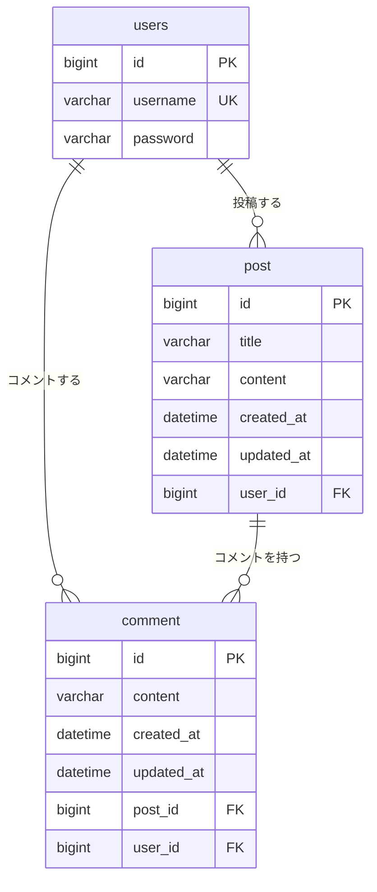

# BBS - Spring Boot 掲示板アプリ

Spring Boot を用いた Web アプリケーション開発の学習用に作成した掲示板アプリです。
ユーザー認証、投稿の CRUD、コメント、キーワード検索、ページング、ソートを実装しています。

## 使用技術

| 分類 | 技術 |
| --- | --- |
| 言語 | Java 26 |
| フレームワーク | Spring Boot 4.1.1 |
| 認証 | Spring Security（フォームログイン / BCrypt） |
| O/R マッパー | Spring Data JPA (Hibernate) |
| テンプレートエンジン | Thymeleaf + Thymeleaf Layout Dialect |
| データベース | MySQL |
| ビルドツール | Maven |
| その他 | Lombok |

## 機能一覧

### 認証
- ユーザー登録（パスワードは BCrypt でハッシュ化して保存）
- ログイン / ログアウト
- 未認証ユーザーのアクセス制限（トップ・登録・ログイン以外は要認証）

### 投稿
- 投稿の一覧・詳細・作成・編集・削除
- 投稿者本人のみ編集・削除が可能
- キーワード検索（**部分一致 / 前方一致 / 後方一致** を選択可能。タイトルと本文の両方を対象）
- ソート（作成日・更新日など、昇順 / 降順）
- ページング

### コメント
- 投稿へのコメント追加
- コメント投稿者本人のみ削除が可能
- 投稿とコメントの一対多リレーション（投稿削除時にコメントも連動削除）

## 画面・ルーティング

| メソッド | パス | 説明 | 認証 |
| --- | --- | --- | --- |
| GET | `/` | トップページ | 不要 |
| GET | `/auth/register` | ユーザー登録フォーム | 不要 |
| POST | `/auth/register` | ユーザー登録 | 不要 |
| GET | `/auth/login` | ログインフォーム | 不要 |
| POST | `/auth/logout` | ログアウト | 不要 |
| GET | `/posts` | 投稿一覧（検索・ソート・ページング） | 必要 |
| GET | `/posts/new` | 新規投稿フォーム | 必要 |
| POST | `/posts` | 投稿の作成 | 必要 |
| GET | `/posts/{id}` | 投稿詳細（コメント一覧を含む） | 必要 |
| GET | `/posts/{id}/edit` | 投稿編集フォーム | 必要 |
| POST | `/posts/{id}` | 投稿の更新 | 必要 |
| POST | `/posts/{id}/delete` | 投稿の削除 | 必要 |
| POST | `/comments/add` | コメントの追加 | 必要 |
| POST | `/comments/{id}/delete` | コメントの削除 | 必要 |

## データモデル



作成日時・更新日時は Hibernate の `@CreationTimestamp` / `@UpdateTimestamp` により自動で記録されます。

## セットアップ

### 必要な環境

- JDK 26
- MySQL 8.0 以降

### 1. データベースを作成する

```sql
CREATE DATABASE board CHARACTER SET utf8mb4 COLLATE utf8mb4_general_ci;
```

テーブルは `spring.jpa.hibernate.ddl-auto=update` により起動時に自動生成されます。

### 2. 接続情報を設定する

`src/main/resources/application.properties` の以下の項目を、自分の環境に合わせて編集してください。

```properties
spring.datasource.url=jdbc:mysql://localhost:3306/board
spring.datasource.username=（MySQL のユーザー名）
spring.datasource.password=（MySQL のパスワード）
```

### 3. アプリケーションを起動する

```powershell
./mvnw spring-boot:run
```

ブラウザで http://localhost:8080 を開きます。
`/auth/register` からユーザー登録を行ってログインしてください。

### ビルド

```powershell
./mvnw clean package
java -jar target/bbs-0.0.1-SNAPSHOT.jar
```

## プロジェクト構成

```
src/main/
├── java/com/example/bbs/
│   ├── BbsApplication.java
│   ├── config/          # Spring Security の設定
│   ├── controller/      # リクエストの受け口
│   ├── model/           # JPA エンティティ
│   ├── repository/      # Spring Data JPA リポジトリ
│   └── service/         # ビジネスロジック
└── resources/
    ├── templates/       # Thymeleaf テンプレート
    │   ├── auth/        # ログイン・ユーザー登録
    │   ├── layout/      # 共通レイアウト
    │   └── posts/       # 投稿の各画面
    └── application.properties
```

## 今後の予定

- [ ] いいね機能（`Like` エンティティのみ作成済み。リポジトリ・画面は未実装）
- [ ] コメントの編集機能
- [ ] 投稿一覧のページ送り UI
- [ ] 接続情報の環境変数化とインターネット公開

## 学習メモ

このアプリは以下の順で段階的に実装しました。

1. 掲示板アプリで Web 開発の基礎を学ぶ（投稿の CRUD）
2. Spring Security でログイン認証機能を実装
3. コメント機能実装 - 一対多リレーションを学ぶ
