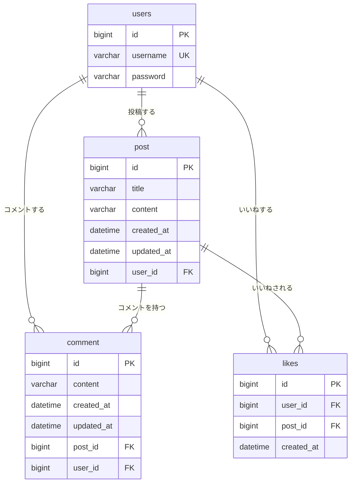

# BBS - Spring Boot 掲示板アプリ

Spring Boot を用いた Web アプリケーション開発の学習用に作成した掲示板アプリです。
ユーザー認証、投稿の CRUD、コメント、いいね、キーワード検索、ページング、ソート、入力バリデーション、お問い合わせフォーム（メール送信）を実装しています。

## 使用技術

| 分類 | 技術 |
| --- | --- |
| 言語 | Java 25 |
| フレームワーク | Spring Boot 4.1.1 |
| 認証 | Spring Security（フォームログイン / BCrypt / CSRF 対策） |
| O/R マッパー | Spring Data JPA (Hibernate) |
| テンプレートエンジン | Thymeleaf + Thymeleaf Layout Dialect |
| バリデーション | Jakarta Bean Validation（`spring-boot-starter-validation`） |
| メール送信 | Spring Mail（Gmail SMTP） |
| フロントエンド | Bootstrap 5 / Bootstrap Icons / Fetch API |
| データベース | MySQL |
| ビルドツール | Maven |
| その他 | Lombok / Spring Boot DevTools |

## 機能一覧

### 認証
- ユーザー登録（パスワードは BCrypt でハッシュ化して保存）
- ログイン / ログアウト
- 未認証ユーザーのアクセス制限（トップ・登録・ログイン・お問い合わせ以外は要認証）
- CSRF 対策（フォームは hidden フィールド、Ajax はリクエストヘッダーでトークンを送信）

### 投稿
- 投稿の一覧・詳細・作成・編集・削除
- 投稿者本人のみ編集・削除が可能
- 入力バリデーション（タイトル必須・100文字以内 / 内容必須・1000文字以内）
  - エラー時は入力内容を保持したままフォームに戻り、項目ごとにエラーメッセージを表示
- キーワード検索（**部分一致 / 前方一致 / 後方一致** を選択可能。タイトルと本文の両方を対象）
- ソート（作成日・更新日など、昇順 / 降順）
- ページング（1ページ3件。検索条件・ソート条件を保持したままページ送り）
- 処理結果をフラッシュメッセージで表示

### コメント
- 投稿へのコメント追加（必須・100文字以内）
- コメント投稿者本人のみ削除が可能
- 投稿とコメントの一対多リレーション（投稿削除時にコメントも連動削除）

### いいね
- 投稿詳細画面のボタンで、いいねの登録 / 解除を切り替え
- 画面遷移なしで更新（Fetch API で非同期通信し、JSON でいいね状態と件数を受け取る）

### お問い合わせ
- 入力 → 確認 → 完了の3画面構成（ログイン不要）
- 送信時に、問い合わせたユーザーと運営者の双方へメールを送信
- `app.mail.enabled` でメール機能の有効 / 無効を切り替え可能（無効時はフォームの代わりに案内を表示）

## 画面・ルーティング

| メソッド | パス | 説明 | 認証 |
| --- | --- | --- | --- |
| GET | `/` | トップページ | 不要 |
| GET | `/auth/register` | ユーザー登録フォーム | 不要 |
| POST | `/auth/register` | ユーザー登録 | 不要 |
| GET | `/auth/login` | ログインフォーム | 不要 |
| POST | `/auth/logout` | ログアウト | 不要 |
| GET | `/posts` | 投稿一覧（検索・ソート・ページング） | 必要 |
| GET | `/posts/new` | 新規投稿フォーム | 必要 |
| POST | `/posts` | 投稿の作成 | 必要 |
| GET | `/posts/{id}` | 投稿詳細（コメント一覧・いいねを含む） | 必要 |
| GET | `/posts/{id}/edit` | 投稿編集フォーム | 必要 |
| POST | `/posts/{id}` | 投稿の更新 | 必要 |
| POST | `/posts/{id}/delete` | 投稿の削除 | 必要 |
| POST | `/posts/{id}/like` | いいねの切り替え（JSON を返す） | 必要 |
| POST | `/comments/add` | コメントの追加 | 必要 |
| POST | `/comments/{id}/delete` | コメントの削除 | 必要 |
| GET | `/contact` | お問い合わせフォーム | 不要 |
| POST | `/contact/confirm` | お問い合わせ内容の確認 | 不要 |
| POST | `/contact/submit` | お問い合わせの送信（メール送信） | 不要 |
| GET | `/contact/complete` | お問い合わせ完了 | 不要 |

## データモデル


```mermaid
erDiagram
    users ||--o{ post : "投稿する"
    users ||--o{ comment : "コメントする"
    users ||--o{ likes : "いいねする"
    post  ||--o{ comment : "コメントを持つ"
    post  ||--o{ likes : "いいねされる"

    users {
        bigint id PK
        varchar username UK
        varchar password
    }
    post {
        bigint id PK
        varchar title
        varchar content
        datetime created_at
        datetime updated_at
        bigint user_id FK
    }
    comment {
        bigint id PK
        varchar content
        datetime created_at
        datetime updated_at
        bigint post_id FK
        bigint user_id FK
    }
    likes {
        bigint id PK
        bigint user_id FK
        bigint post_id FK
        datetime created_at
    }
```

作成日時・更新日時は Hibernate の `@CreationTimestamp` / `@UpdateTimestamp` により自動で記録されます。
`like` は MySQL の予約語のため、テーブル名は `likes` にしています。

## セットアップ

### 必要な環境

- JDK 25
- MySQL 8.0 以降
- （メール送信を使う場合）Gmail アカウントとアプリパスワード

### 1. データベースを作成する

```sql
CREATE DATABASE board CHARACTER SET utf8mb4 COLLATE utf8mb4_general_ci;

-- アプリ用ユーザー（root は使わない）
CREATE USER 'appuser'@'localhost' IDENTIFIED BY 'appuser';
GRANT ALL PRIVILEGES ON board.* TO 'appuser'@'localhost';
```

テーブルは `spring.jpa.hibernate.ddl-auto=update` により起動時に自動生成されます。

### 2. 接続情報を設定する

パスワードなどの秘密情報は `application.properties` に直接書かず、次のどちらかの方法で設定します。

#### 方法A：ローカル用の設定ファイルを使う（推奨）

`src/main/resources/application-local.properties` を作成し、以下を記入します。
このファイルは `.gitignore` に登録済みのため、Git にはコミットされません。

```properties
# MySQL
spring.datasource.username=（MySQL のユーザー名）
spring.datasource.password=（MySQL のパスワード）

# メール（使わない場合は app.mail.enabled=false にして以下は省略可）
app.mail.enabled=true
spring.mail.username=（Gmail アドレス）
spring.mail.password=（Gmail のアプリパスワード）
mail.from=（送信元アドレス）
mail.admin=（運営者の受信アドレス）
```

#### 方法B：環境変数を使う

| 環境変数 | 内容 | 既定値 |
| --- | --- | --- |
| `DB_URL` | 接続 URL | `jdbc:mysql://localhost:3306/board` |
| `DB_USER` | MySQL のユーザー名 | なし（必須） |
| `DB_PASSWORD` | MySQL のパスワード | なし（必須） |

> **補足**：メール送信を使う場合（`app.mail.enabled=true`）は、`mail.from` / `mail.admin` を
> プロパティか環境変数（`MAIL_FROM` / `MAIL_ADMIN`）で指定してください。
> メール送信を使わない場合（`app.mail.enabled=false`）は省略できます。

### 3. アプリケーションを起動する

方法A（`local` プロファイルを有効にして起動）：

```powershell
./mvnw spring-boot:run "-Dspring-boot.run.profiles=local"
```

方法B（環境変数で起動）：

```powershell
$env:DB_USER="appuser"; $env:DB_PASSWORD="appuser"
./mvnw spring-boot:run
```

ブラウザで http://localhost:8080 を開きます。
`/auth/register` からユーザー登録を行ってログインしてください。

### ビルド

```powershell
./mvnw clean package
java -jar target/bbs-0.0.1-SNAPSHOT.jar --spring.profiles.active=local
```

## プロジェクト構成

```
src/main/
├── java/com/example/bbs/
│   ├── BbsApplication.java
│   ├── config/          # Spring Security の設定
│   ├── controller/      # リクエストの受け口
│   ├── dto/             # フォーム入力用オブジェクト（バリデーション定義）
│   ├── model/           # JPA エンティティ
│   ├── repository/      # Spring Data JPA リポジトリ
│   └── service/         # ビジネスロジック（メール送信を含む）
└── resources/
    ├── templates/       # Thymeleaf テンプレート
    │   ├── auth/        # ログイン・ユーザー登録
    │   ├── contact/     # お問い合わせ（入力・確認・完了）
    │   ├── layout/      # 共通レイアウト
    │   ├── posts/       # 投稿の各画面
    │   └── home.html    # トップページ
    ├── application.properties        # 共通設定
    ├── application-local.properties  # ローカル用の秘密情報（Git 管理外）
    └── messages.properties           # バリデーションエラーメッセージ
```

## 今後の予定

- [ ] コメントの編集機能
- [ ] お問い合わせフォームの入力バリデーション
- [ ] 同じユーザーが同じ投稿に重複していいねできないよう、DB にユニーク制約を追加
- [ ] インターネット公開

## 学習メモ

このアプリは以下の順で段階的に実装しました。

1. 掲示板アプリで Web 開発の基礎を学ぶ（投稿の CRUD）
2. Spring Security でログイン認証機能を実装
3. コメント機能実装 - 一対多リレーションを学ぶ
4. 入力バリデーション - DTO と Bean Validation、エラーメッセージの外部化
5. いいね機能 - Fetch API による非同期通信と CSRF トークンの扱い
6. お問い合わせフォーム - Spring Mail によるメール送信、設定ファイルの分離
